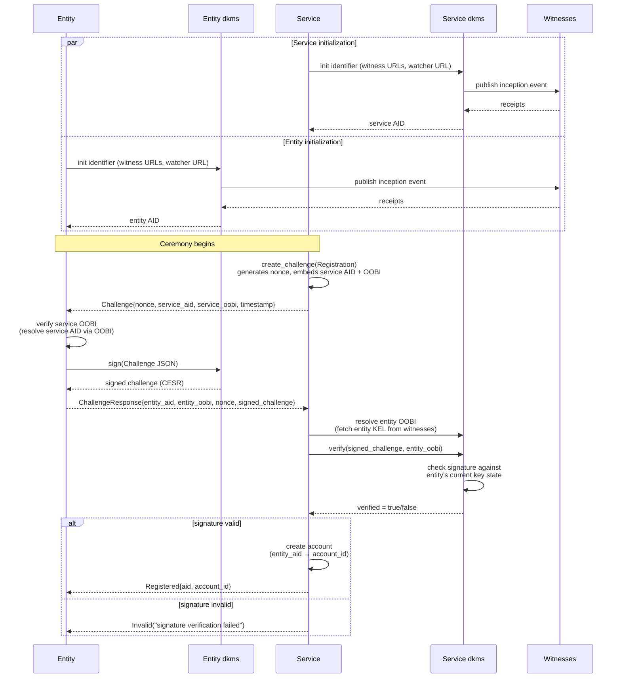
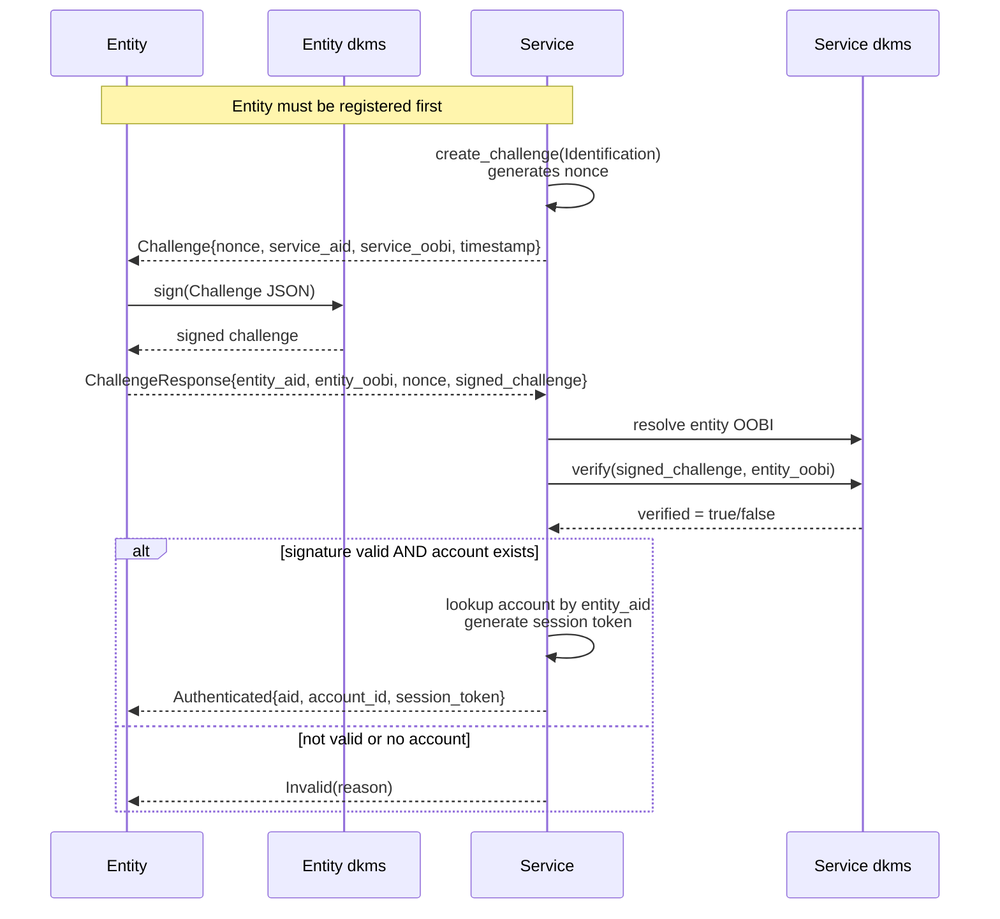
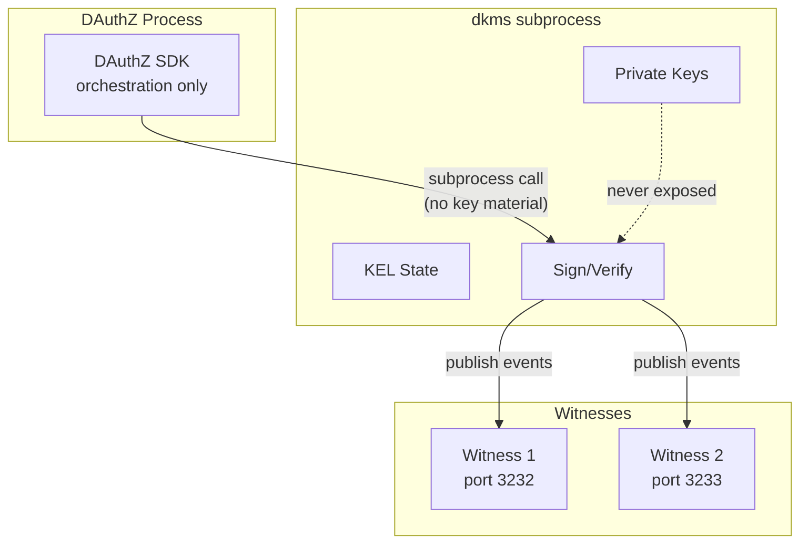

# DAuthZ — Decentralized Authorization

KERI-based identification and authorization framework. Client and server SDKs
that orchestrate registration, login ceremonies, delegating
all cryptographic operations to the `dkms` CLI binary.

## Architecture

```
dauthz/
├── dauthz-core/       Shared types: payloads, challenges, errors, ceremony state
├── dauthz-client/     Client SDK — Entity/SAS side (registration, login, rotation)
├── dauthz-server/     Server SDK — Service side (challenge, verify, accounts)
└── dauthz-bin/        Test binary with end-to-end ceremony scenarios
```

Neither SDK touches keys directly. The `dkms` binary is the single source of
truth for AID lifecycle, signing, verification, and KEL operations. DAuthZ
orchestrates ceremony flows and transport protocol, invoking `dkms` as a subprocess
for every cryptographic operation.

## Prerequisites

| Requirement | Version | Notes |
|---|---|---|
| Rust toolchain | 1.70+ | `rustup` recommended |
| `dkms` binary | latest | Must be in `PATH` or specified via `DKMS_BINARY` env var |
| KERI infrastructure | dkms-demo | Witnesses + watcher running (for integration tests) |

## Ceremony Flows

### Registration Ceremony

The registration ceremony establishes a trust relationship between an Entity
(client) and a Service. Both sides create KERI identifiers (AIDs) which allows
for trust continuity, then exchange signed challenges to prove
control of their keys. At this stage nothing is known about either user or
service for that purpose credential/claims needs to be exchanged to start
building up trust relationship.



### Identification (Login) Ceremony

The login ceremony authenticates an already-registered Entity to the Service.
The flow mirrors registration but uses `Identification` as the ceremony purpose
to distinquish between two for security reasons and results in a session token
instead of account creation.



## Security Model

### Key Isolation



- **Private keys never enter DAuthZ memory.** All cryptographic operations
(signing, verification, key generation) are delegated to the `dkms` binary via
subprocess calls. DAuthZ only receives and sends serialized data.
- **Separate dkms contexts.** Client and server each use isolated dkms aliases
with independent `HOME` directories. A compromise of one context does not
affect the other.

### Challenge-Response Security

| Property | Mechanism |
|---|---|
| **Freshness** | Each challenge contains a random UUID nonce. Nonces are single-use — consumed after verification. |
| **Binding** | The challenge embeds the service AID and OOBI, binding it to a specific service instance. |
| **Timestamp** | RFC 3339 timestamp enables replay-window enforcement. |
| **Expiration** | RFC 3339 timestamp assuring about short-live span of the challange. |
| **Proof of control** | The entity must sign the entire challenge JSON, proving possession of the current private key. |
| **Non-replayable** | The nonce is consumed after one successful verification, preventing replay attacks. |

### Ceremony Guarantees

**Registration** proves:
1. The entity controls the private key for the AID it claims (signature over challenge).
2. The service AID is authentic (entity verifies service AID).

**Login** proves:
1. The entity still controls the current key for a registered AID.
3. The session token is bound to a verified, registered account.

## Development

### Build

```sh
# Debug build (all crates)
cargo build

# Release build
cargo build --release

# Build a specific crate
cargo build -p dauthz-core
cargo build -p dauthz-client
cargo build -p dauthz-server
cargo build -p dauthz-bin
```

### Check (fast, no codegen)

```sh
cargo check
cargo check -p dauthz-client
```

### Lint

```sh
# Clippy on the whole workspace
cargo clippy --all-targets -- -D warnings

# Clippy on a single crate
cargo clippy -p dauthz-core -- -D warnings
```

### Format

```sh
cargo fmt --all -- --check   # check only
cargo fmt --all              # apply
```

### Run the test binary

```sh
# See available commands
cargo run -p dauthz-bin

# Individual ceremony tests (requires dkms binary + infrastructure)
cargo run -p dauthz-bin -- test-registration
cargo run -p dauthz-bin -- test-login
cargo run -p dauthz-bin -- test-rotation
cargo run -p dauthz-bin -- test-full

# Specify dkms binary path via environment variable
DKMS_BINARY=/usr/local/bin/dkms cargo run -p dauthz-bin -- test-full
```

## Testing

### Unit tests

No external dependencies required. These test core types, serialization, and store logic:

```sh
cargo test -p dauthz-core
```

### Integration tests (require infrastructure)

Integration tests invoke the `dkms` binary and need KERI infrastructure running. The test scenarios in `dauthz-bin` validate full ceremony flows.

1. **Start KERI infrastructure** (witnesses on ports 3232/3233, watcher on 3235):

   ```sh
   # From dkms-demo project — adjust to your setup
   docker-compose up -d
   ```

2. **Ensure `dkms` is available** — either in `PATH` or via the `DKMS_BINARY` environment variable:

   ```sh
   # Option A: dkms already in PATH
   which dkms

   # Option B: specify explicit path
   export DKMS_BINARY=/path/to/dkms
   ```

3. **Run test scenarios**:

   ```sh
   # Full end-to-end: service init -> client init -> registration -> rotation -> Login
   cargo run -p dauthz-bin -- test-full

   # Individual ceremonies
   cargo run -p dauthz-bin -- test-registration
   cargo run -p dauthz-bin -- test-login
   cargo run -p dauthz-bin -- test-rotation
   ```

4. **Clean test state** (stored in `$TMPDIR/dauthz-test/`):

   ```sh
   rm -rf /tmp/dauthz-test
   rm -rf /tmp/dauthz
   rm -rf /tmp/dauthz-server
   ```


## Project Conventions

- **No keys in DAuthZ memory** — all signing/verification goes through `dkms` subprocess
- **No KERI library dependency** — the only interface to KERI is the `dkms` CLI stdout/stderr

## Environment Variables

| Variable | Default | Purpose |
|---|---|---|
| `DKMS_BINARY` | `dkms` | Path to the dkms CLI binary (used by `dauthz-bin` test scenarios) |
| `HOME` | set by DkmsBridge | Used by dkms for state directory (`~/.dkms-dev-cli/`) |
